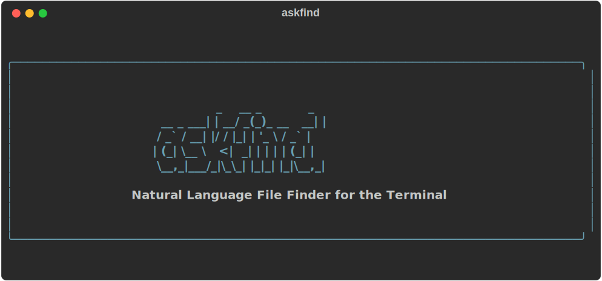
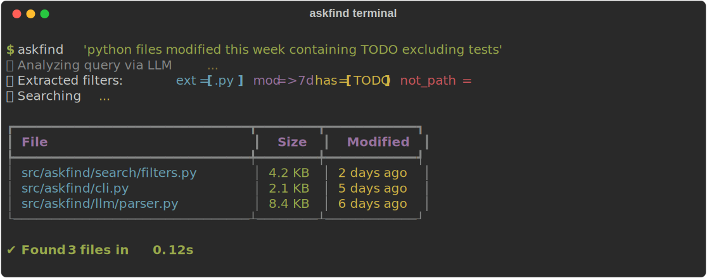
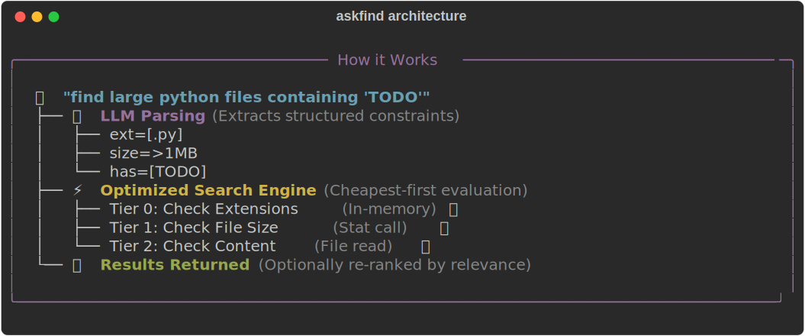
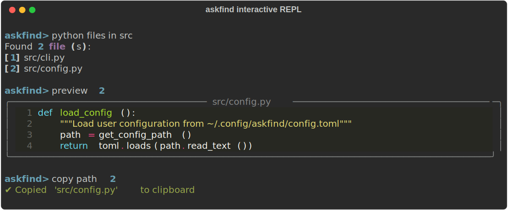

<div align="center">



**Find files using plain English. Stop fighting with complex `find` syntax.**

[](https://python.org)
[](https://opensource.org/licenses/MIT)
[](https://github.com/wgsim/natural_language_base_file_finder_in_terminal/actions)



*The fastest way to search your codebase without breaking your flow.*

</div>

---

## Why askfind?

We've all been there. You just want to find a specific file, but instead, you end up Googling "how to find files modified in the last 7 days excluding test directories." 

**The old way:**
```bash
find . -type f -name "*.py" -mtime -7 -not -path "*/vendor/*" -exec grep -l "TODO" {} +
```

**The `askfind` way:**
```bash
askfind "python files modified this week containing TODO excluding vendor"
```

Under the hood, `askfind` uses an LLM to instantly translate your natural language query into an optimized, highly efficient file system traversal plan. It's smart, fast, and incredibly intuitive.



## ✨ Core Benefits

- 🗣️ **Zero Learning Curve**: If you can type it in English, you can find it. No more regex cheat sheets.
- ⚡ **Lightning Fast Execution**: `askfind` intelligently applies cheap filters (like file extensions and paths) *before* expensive I/O operations (like reading file contents), minimizing search time.
- 🎯 **Semantic Re-ranking**: Results aren't just listed; they're optionally re-ranked by the LLM so the most relevant files appear exactly where you look first.
- 🔒 **Privacy & Security First**: Your API keys are locked securely in your OS keychain. Only file paths and your query are sent to the LLM—**your file contents stay local.**
- 🔌 **100% Offline Capable**: Working on a plane? No problem. Use `--offline` to instantly skip the LLM and rely on our fast local heuristic parser.
- 💻 **Interactive REPL**: Use `askfind -i` for an interactive terminal session where you can preview, open, and copy files directly.

<div align="center">
  
</div>

## 🚀 Quick Start

### 1. Install

Make sure you have Python 3.12+ installed.

#### Recommended for end users: install from PyPI with `pipx`

Once `askfind` is published to PyPI, install it in an isolated tool environment:

```bash
pipx install askfind
askfind --help
```

If `pipx` is installed but `askfind` is not found on your `PATH`, run:

```bash
pipx ensurepath
```

#### Alternative: install from PyPI with `uv tool`

If you use `uv`, you can install the CLI without manually activating a virtual environment:

```bash
uv tool install askfind
askfind --help
```

If `uv` warns that its tool bin directory is not on your `PATH`, run:

```bash
uv tool update-shell
```

#### Development or unreleased source install

If you are working directly from this repository before a PyPI release is available:

```bash
git clone https://github.com/wgsim/natural_language_base_file_finder_in_terminal.git
cd natural_language_base_file_finder_in_terminal
pip install -e ".[dev]"
```

### 2. Configure (One-time setup)

Store your preferred LLM provider's API key (e.g., OpenRouter, OpenAI) securely in your system keychain:

```bash
askfind config set-key
# Paste your API key when prompted
```

### 3. Find!

```bash
# Basic searches
askfind "large javascript files"
askfind "config files in src excluding tests"

# Combine multiple constraints naturally
askfind "small python files in src modified today containing async"
```

## 🛠️ Advanced Usage

`askfind` is packed with power-user features:

```bash
# Get detailed file info (size, date)
askfind "python files" --verbose

# Output JSON for use in other scripts
askfind "python files" --json

# Limit results and parallelize traversal
askfind "python files" --max 10 --workers 8

# Create a permanent index for massive repositories to speed up future queries
askfind index build --root .
```

Check out our [Documentation](docs/) for more details on caching, index management, and configuration.

## ⚙️ Configuration

`askfind` is highly customizable via `~/.config/askfind/config.toml`:

```bash
askfind config set model "gpt-4o-mini"
askfind config set max_results 100
askfind config set parallel_workers 4
```

*Want to use a local LLM? Point it to your Ollama server:*
```bash
askfind config set base_url "http://localhost:11434/v1"
askfind config set model "llama3"
```

## 📦 Packaging Notes

- End-user installation should target PyPI via `pipx install askfind` as the primary path.
- `uv tool install askfind` is a supported alternative for users already on `uv`.
- The source install flow (`pip install -e ".[dev]"`) is intended for contributors and local development, not for general end users.

## 🤝 Contributing

We welcome contributions! Please see our [Contributing Guide](CONTRIBUTING.md) to get started.

1. Fork the repository
2. Create a feature branch
3. Run tests with `pytest`
4. Submit a Pull Request

## 📄 License

MIT License - see the [LICENSE](LICENSE) file for details.

---
<div align="center">
  <b>Suggested GitHub Topics:</b> <code>cli</code>, <code>terminal</code>, <code>search</code>, <code>file-search</code>, <code>llm</code>, <code>ai-tools</code>, <code>productivity</code>, <code>python</code>, <code>developer-tools</code>
</div>
